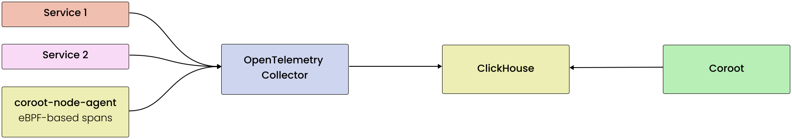
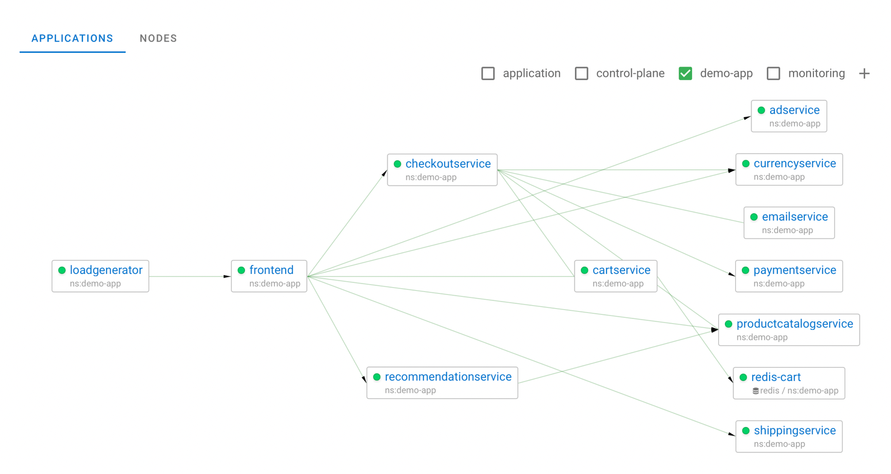
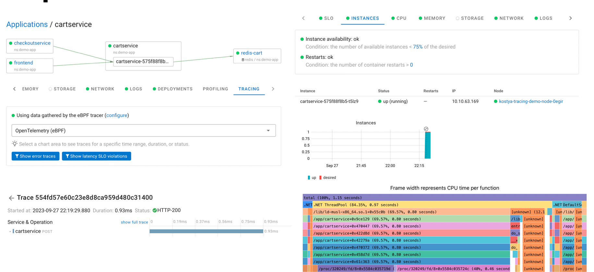
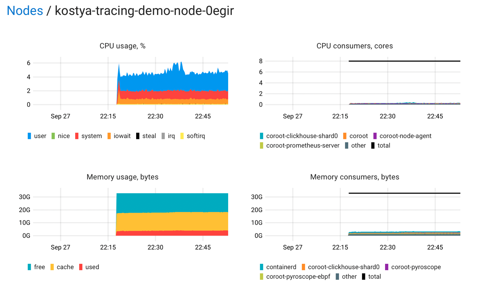

https://coroot.com/docs/coroot-community-edition

> Zero-instrumentation observability tool for microservice architectures



### FOR DEMO PURPOSES ONLY

### Contents
1. [Requirements](#requirements)
2. [Prerequisites](#prerequisites)
3. [Installation](#how-to-install)
4. [Screenshots](#screenshots)

### What's inside:
1. Coroot Community Edition
2. Prometheus
3. Pyroscope
4. Clickhouse

### Requirements:
1. Storage with free space around 20 GB

### Prerequisites
1. helm (v3.10+)
2. If your cluster isn't located in ru-7, then you need to change storageClassName in [values.yaml](values.yaml) file

### How to install
1. Install chart
    ```shell
    helm repo add coroot https://coroot.github.io/helm-charts
    helm repo update
    
    helm install -f values.yaml --namespace coroot --create-namespace coroot coroot/coroot
    ```

2. Forward the Coroot port to your machine:
    ```shell
    kubectl port-forward -n coroot service/coroot 8080
    ```

### Screenshots



