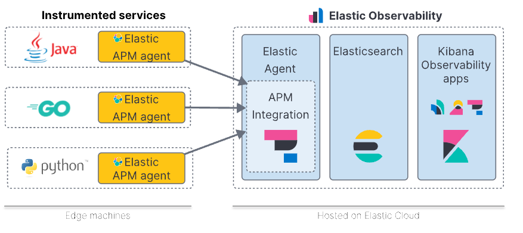
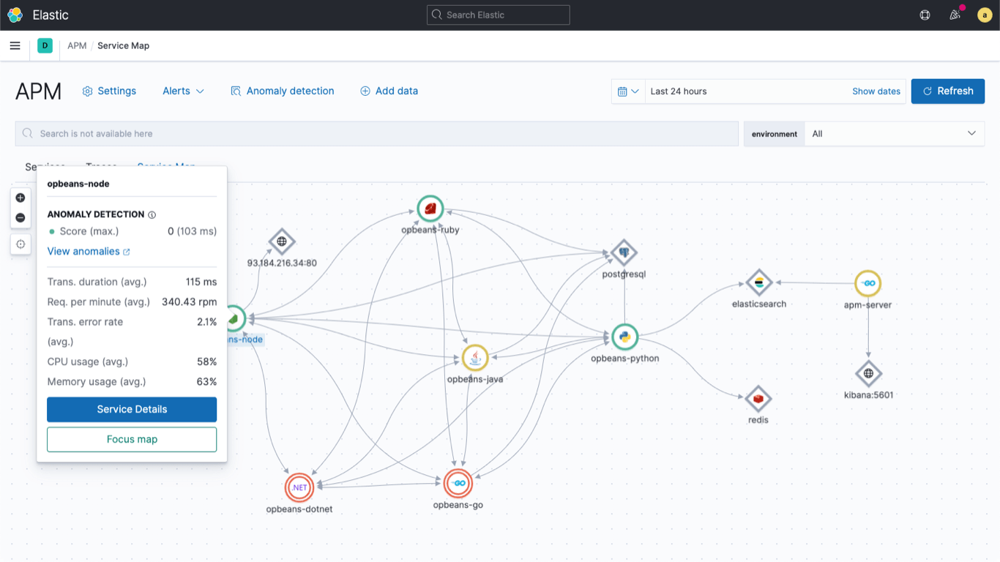

# Elastic APM

> Instrument your code and collect performance data and errors at runtime by installing APM agents like Java, Go, .NET, and many more.



### Contents
1. [Installation](#installation)
2. [Screenshots](#screenshots)

### Note:
If your cluster isn't located in ru-7,
then you need to change storageClassName 
in kustomize patch located at [components/pvc_patch.yaml](./components/pvc_patch_es.yaml)

### Installation:
```shell
kubectl apply -k elastic
```

### Screenshots



