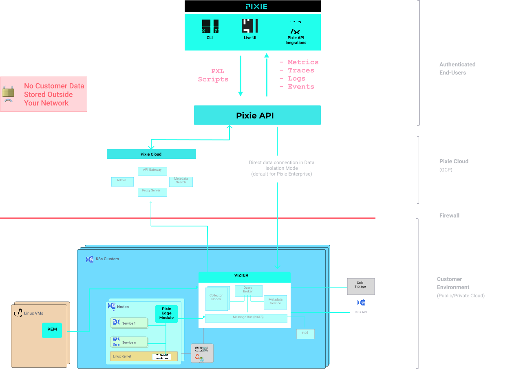
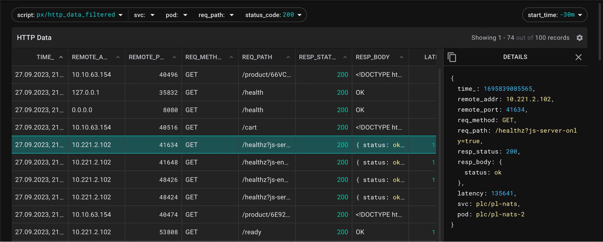
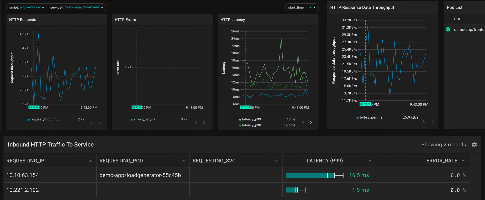

# [Pixie (v0.1.7)](https://px.dev)
> Pixie is an open source observability tool for Kubernetes applications. Pixie uses eBPF to automatically capture telemetry data without the need for manual instrumentation.



### FOR DEMO PURPOSES ONLY

#### Note:
1. Pixie captures spans, but not full traces - [roadmap](https://docs.px.dev/about-pixie/roadmap)
2. Pixie stores traces for 24h, you need to setup long-term storage by yourself (OTel collector + Clickhouse/Elasticsearch/etc.)

### Contents
1. [Cluster prepare steps](#cluster-prepare)
2. [Pixie installation](#pixie-install)
3. [Screenshots](#screenshots)

### Preparation steps
1. Fetch submodule
   ```shell
   git submodule init
   git submodule update
   ```
2. If your cluster isn't located in ru-7, then you need to change storageClassName in kustomize patches located at [cloud_deps](cloud_deps) folder

### Cluster prepare
1. First, we need to deploy ECK operator:
    ```shell
    kubectl apply -k eck
    ```
2. After that, create a few secrets using a bash script (don't forget to create namespace `plc`):
    ```shell
   kubectl create namespace plc
   
    ./pixie/scripts/create_cloud_secrets.sh
    ```
3. Install cloud dependencies (postgres, nats, etc.):
   ```shell
   kubectl apply -k cloud_deps
   ```
4. Install cloud itself:
   ```shell
   kubectl apply -k cloud
   ```
5. Wait until services with LoadBalancer type retrieve external IP address:
   ```shell
   kubectl get service cloud-proxy-service -n plc
   kubectl get service vzconn-service -n plc
   ```
6. Setup DNS:
   ```shell
   cd pixie && go build ./src/utils/dev_dns_updater/dev_dns_updater.go
   
   cd ../ && ./pixie/dev_dns_updater --domain-name="dev.withpixie.dev"  --kubeconfig=$HOME/.kube/target-cluster-config --n=plc
   ```

### Pixie install
1. install CLI:
   ```shell
   export PL_CLOUD_ADDR=dev.withpixie.dev
   bash -c "$(curl -fsSL https://withpixie.ai/install.sh)"   
   ```
2. Login
   ```shell
   # user: admin@default.com
   # password: admin
   #
   px auth login --manual
   ```
3. Deploy pixie to cluster:
   ```shell
   # pixie cli doesn't support kubeconfig with multiple contexts, so we need to override KUBECONFIG env with target config
   #
   # https://github.com/pixie-io/pixie/issues/240
   export KUBECONFIG=$HOME/.kube/target-cluster-config.yaml
   ```

   ```shell
   # there's will be error - "ERR: Cluster type is not in list of known supported cluster types"
   # just type "Y"
   #
   px deploy --dev_cloud_namespace plc
   ```
   
That's all, Pixie ready for work:
https://work.dev.withpixie.dev/live

### Links:
   1. https://docs.px.dev/installing-pixie/install-guides/self-hosted-pixie/
   2. https://docs.px.dev/tutorials/pixie-101/request-tracing/

### Screenshots
There are some screenshots from running Pixie instance (its small part of its features)



